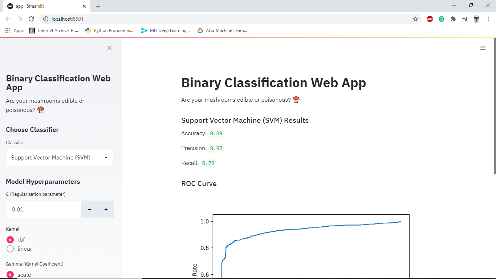

# Web-application-for-testing-ML-algorithms

Inspired From DeepLearning Playground by Google, simillar kind of application where you can test your algorithms with suitable parameters and check ROC, Confusion Matrix and Precession-Recall Curve.

Run following codes in CLI:
 >> cd <location of ur app>
 >> streamlit run app.py
 
 Screenshot:
 
